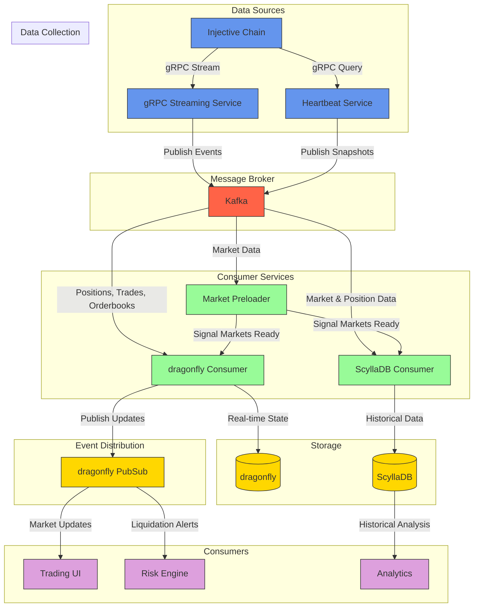

# Injective Exchange Data Pipeline

## Overview
This project implements a high-performance data pipeline for processing Injective exchange data. It consists of two main components: a gRPC service for collecting data from Injective's API and a consumer service for processing and storing this data.

## Architecture



### Components

#### gRPC Service
- Connects to Injective's streaming and query endpoints
- Collects real-time market data (trades, orderbooks, positions)
- Periodically fetches market snapshots with heartbeat service
- Publishes all data to Kafka

#### Consumer Service
1. **Market Preloader**: 
   - Prioritizes processing market data first
   - Establishes baseline reference data before processing positions

2. **dragonfly Consumer**:
   - Maintains real-time state of markets and positions
   - Calculates liquidation prices
   - Identifies liquidatable positions
   - Publishes updates via dragonfly PubSub

3. **ScyllaDB Consumer**:
   - Stores historical market and position data
   - Maintains time-series of liquidation prices
   - Provides queryable database of liquidatable positions

### Event-Driven Architecture
The system is built on a fully event-driven architecture:

1. **Event Production**:
   - gRPC service captures exchange events (trades, orderbook updates, position changes)
   - Each event is serialized and published to Kafka topics

2. **Event Processing**:
   - Consumer services process events asynchronously
   - Processing occurs in phases to maintain data consistency
   - Each consumer handles specific event types independently
   - Events trigger calculations like liquidation prices

3. **Event Distribution**:
   - Processed events are published to dragonfly PubSub
   - Consumers can subscribe to specific event types
   - Low-latency notification for critical events like liquidations

4. **Data Flow**:
   - gRPC service collects data from Injective endpoints
   - Data is serialized and published to Kafka
   - Consumer components process data in phases:
     - Markets are processed first
     - Positions and other data follow
   - Real-time updates are published via dragonfly PubSub
   - Historical data is stored in ScyllaDB

## Features
- Fully event-driven architecture
- Loosely coupled components for scalability
- Phase-based processing to ensure data consistency
- Optimized Kafka batching for high throughput
- High-performance dragonfly PubSub for real-time updates
- Accurate liquidation price calculation
- Liquidation alerting system
- Distributed processing with specialized consumers

## Configuration
The system is configurable through environment variables or config files:

```
GRPC_STREAM_ENDPOINT=http://injective-stream:1999
GRPC_QUERY_ENDPOINT=http://injective-query:9900
KAFKA_BROKERS=kafka1:9092,kafka2:9092
KAFKA_TOPIC=injective-data
DRAGONFLY_URL=dragonfly://dragonfly:6379
SCYLLADB_NODES=scylla1:9042,scylla2:9042
```

## Deployment
The system can be deployed using Docker Compose:

```bash
# Build and start all services with a single command
docker-compose up -d
```

This will start the entire stack including:
- gRPC service
- Consumer service
- Kafka
- Dragonfly
- ScyllaDB

Everything is configured to work together out of the box.

## Requirements
- Rust 1.73+
- Kafka
- dragonfly
- ScyllaDB
- Injective API access